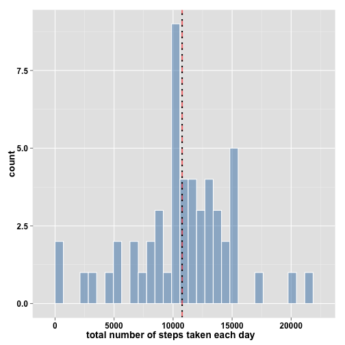
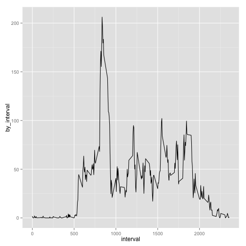
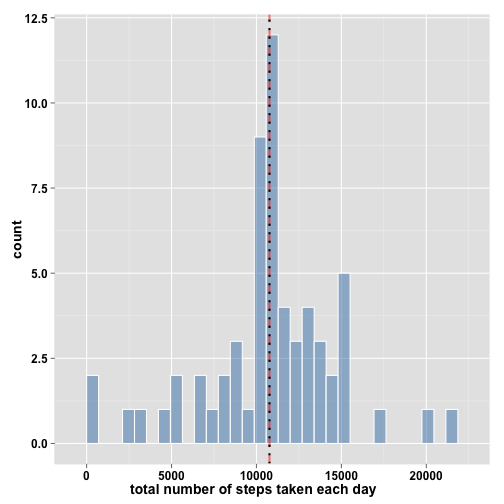
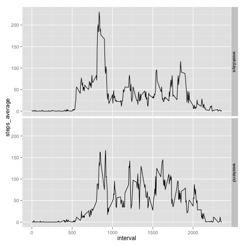

This is the course project for the second week of Reproducible Research.  


**This the code for the question 1: I load the dataset**  
**Loading and preprocessing the data**

```r
library(ggplot2)
library(devtools)
library(easyGgplot2)     # Packages will use in the code
library(plyr)
data<-read.csv("activity.csv", header = TRUE)
head(data)
```

```
##   steps       date interval
## 1    NA 2012-10-01        0
## 2    NA 2012-10-01        5
## 3    NA 2012-10-01       10
## 4    NA 2012-10-01       15
## 5    NA 2012-10-01       20
## 6    NA 2012-10-01       25
```


**What is mean total number of steps taken per day?**


```r
steps_day<-sapply(split(data$steps,data$date), sum) #table of total number steps
                                                    #taken per day

mean_day  <-mean  (na.omit(steps_day))              #mean 
median_day<-median(na.omit(steps_day))              #median

g<-ggplot2.histogram(steps_day, fill = "steelblue", col = "white"
                    ,addMeanLine=TRUE,    meanLineColor =   "red"
                    ,meanLineSize = 1,            alpha =    0.5)

g<-   g   +     labs(x = 'total number of steps taken each day' ) +
          geom_vline(xintercept = median_day, linetype ="dotted" 
                         ,color =    "black",     size = 1      )
print(g)                                           #plot
```

 

The mean of the total number of steps taken per day is **10766**  
The median of the total number of steps taken per day is **10765**  
  
**What is the average daily activity pattern?**

```r
 by_interval<-sapply    (split(data$steps,data$interval),  mean,   na.rm = TRUE)
 DT         <-data.frame(by_interval, interval = as.numeric(names(by_interval)))

 ggplot(DT, aes(interval,by_interval))         + geom_line ()
```

 

```r
 interval_with_max_steps <-names(by_interval[which.max(DT$by_interval)])
                          #interval which contains the max number of steps
```
The 5-minute interval which contains the maximum number of steps is the interval **835**  

**Imputing missing values**

```r
table(is.na(data))[2] #number of rows with missing values in the dataset
```

```
## TRUE 
## 2304
```

```r
#data2 is data filled with the mean each 5-minutes interval
 data2<-data
 for(i in 1:length(data$steps)){
     if(  is.na(data$steps[i]))
         data2$steps[i]<-DT[DT$interval==data$interval[i],][[1]]
 }
 head(data2)
```

```
##       steps       date interval
## 1 1.7169811 2012-10-01        0
## 2 0.3396226 2012-10-01        5
## 3 0.1320755 2012-10-01       10
## 4 0.1509434 2012-10-01       15
## 5 0.0754717 2012-10-01       20
## 6 2.0943396 2012-10-01       25
```

```r
 by_interval2<-sapply(split(data2$steps,data2$date), sum)
 mean_day2   <-mean  (by_interval2)                   #mean with NA filled
 median_day2 <-median(by_interval2)                   #median with NA filled

 g1          <-ggplot2.histogram(by_interval2, fill = "steelblue",col = "white"
                     ,addMeanLine = TRUE, meanLineColor="red", meanLineSize = 1
                     , alpha       = 0.5 )
g1           <-g1     +     labs(x = 'total number of steps taken each day') +
                      geom_vline(xintercept = median_day2, linetype="dotted", 
                      color = "black", size=1)

print(g1)
```

 

The mean of the total number of steps taken per day is **10766**  
The median of the total number of steps taken per day is **10766**  
**The mean and the median are now equal (with the dataset wher NA have been filled)**  

**Are there differences in activity patterns between weekdays and weekends?**  

```r
#new dataset with the factors weekends and weekdays
data3<-mutate(data2, day_name = weekdays(as.Date(data2$date)))
data3[data3$day_name=="Dimanche"|data3$day_name=="Samedi",]$day_name<-
  matrix("weekend",
  length(data3[data3$day_name=="Dimanche"|data3$day_name=="Samedi",]$day_name)
  ,1)

data3[data3$day_name!="weekend",]$day_name<-
  matrix("weekdays",
  length(data3[data3$day_name!="weekend",]$day_name)
  ,1)
data3$day_name<-as.factor(data3$day_name)
head(data3)  
```

```
##       steps       date interval day_name
## 1 1.7169811 2012-10-01        0 weekdays
## 2 0.3396226 2012-10-01        5 weekdays
## 3 0.1320755 2012-10-01       10 weekdays
## 4 0.1509434 2012-10-01       15 weekdays
## 5 0.0754717 2012-10-01       20 weekdays
## 6 2.0943396 2012-10-01       25 weekdays
```

```r
#Now, we will make the plot with the average number of steps taken, averaged #across all weekday days or weekend days
a <-split (data3,data3$day_name)
a1<-sapply(split(a$weekdays$steps,a$weekdays$interval),    mean)
A1<-data.frame(steps_average=a1,interval = as.numeric(names(a1))
              ,   type_day  = "weekdays")

a2<-sapply(split(a$weekend$steps, a$weekend$interval),     mean)
A2<-data.frame(steps_average=a2,interval = as.numeric(names(a2))
               ,  type_day  = "weekend" )

A3<-rbind(A1,A2)
ggplot(A3, aes(interval,steps_average)) +            geom_line()+
                                          facet_grid(type_day~.)
```

 
